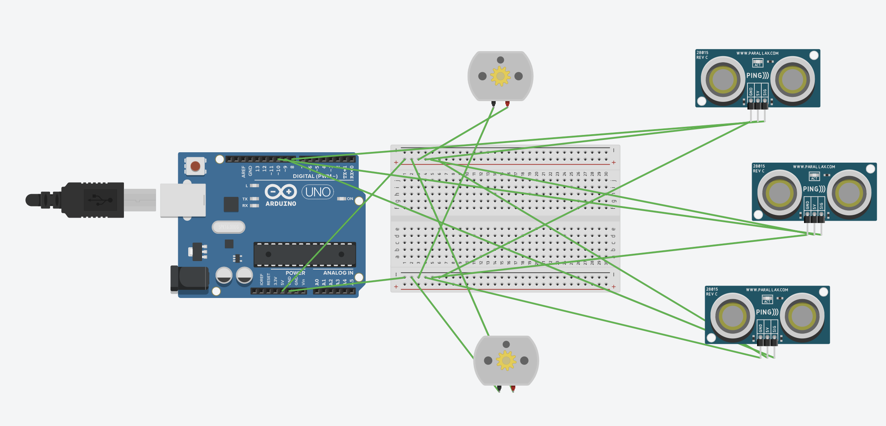

# Tiny Wanderer Table Top Robot
The Tiny Wanderer roves around any table top or surface with edges and uses IR LED's and IR Photo Resistors to calculate distance to prevent it from falling off the edge. Utilizing a hand built PCB to control all the parts. The robot houses two servos to provide power to the wheels and a third unpowered wheel to stabilize. The brains of the robot comes from one arduino uno.


| **Engineer** | **School** | **Area of Interest** | **Grade** |
|:--:|:--:|:--:|:--:|
| David M | Menlo School | Computer Engineering | Incoming junior


# Modificationss

<iframe width="560" height="315" src="https://www.youtube.com/embed/R8zIvkYn7kQ" title="YouTube video player" frameborder="0" allow="accelerometer; autoplay; clipboard-write; encrypted-media; gyroscope; picture-in-picture; web-share" allowfullscreen></iframe> 

For my modifications, I chose to add another sensor to my robot so that, as well as avoiding falling off the edge of tables, it could avoid running into objects on any table top. Using a forward-facing sensor to detect the distance in front of the robot. This was somewhat difficult because first I had to figure out how to add another sensor into my code and make sure that I got data from that sensor as well as the other two sensors, as well as changing my conditional statement so that it could take the forward-facing distance into consideration and figure out which way to turn. At the same time, this modification was quite intuitive because it felt like adding to the existing structure rather than completely changing it. Overall, this project took a long time and provided a lot of opportunities to learn and grow.
  
# Final Milestone

<iframe width="560" height="315" src="https://www.youtube.com/embed/SZJ_4FntxYo" title="YouTube video player" frameborder="0" allow="accelerometer; autoplay; clipboard-write; encrypted-media; gyroscope; picture-in-picture; web-share" allowfullscreen></iframe>

My final milestone was the culmination of all my hard work. After getting the servos to move, I went to try and get the servos working. I ran into an interesting error where, despite the wiring being correct, one of my sensors would read and the other wouldn't. I then figured out that sensors used with an Arduino have to be used one after another or sequentially. After getting all of my components set up and working, it was time for the code, which proved challenging in its own right because of how the servos are controlled. It became a bit confusing to know how the sensors would work. Overall, this third milestone took a lot of testing because the values had to be fine-tuned to make sure the momentum of the robot didn't carry it off the table. This, combined with anything coming unplugged, meant the sensors would read zero and mess up my code. This really tested my ingenuity and provided a satisfying challenge to complete.


# Second Milestone

<iframe width="560" height="315" src="https://www.youtube.com/embed/NablTumPRHw" title="YouTube video player" frameborder="0" allow="accelerometer; autoplay; clipboard-write; encrypted-media; gyroscope; picture-in-picture; web-share" allowfullscreen></iframe>

For my second milestone, I started out trying to solder my own control board following the schematics of a PCB. I got all of the components in and then wired it all. After that, I realized that my microcontroller hadn't been flashed, meaning it didn't have any of the code, so I had to take it out and learn how to use software like AVRdude and the terminal on my mac to flash the files and burn them onto the microcontroller. After all that effort, I ran into the problem of my control board just not working, and despite my determined efforts, I had to make the decision to pivot to an Arduino, so within a short time I had to find new sensors and learn to use an Arduino, something I had never done before. This second milestone shows how I learned to set up the software and get my servos connected and running with the code. Overall, this milestone tested my resolve and really brought what felt like an endless challenge, but it also made the end result of seeing this robot move so satisfying.


# First Milestone

<iframe width="560" height="315" src="https://www.youtube.com/embed/DBCdxo9IWro" title="YouTube video player" frameborder="0" allow="accelerometer; autoplay; clipboard-write; encrypted-media; gyroscope; picture-in-picture; web-share" allowfullscreen></iframe>

My first milestone was to construct the chassis of the little wanderer robot, which bears the control board and servos. The majority of it is constructed of plastic and screws, which creates a box-like structure that wheels attach to. There is also one smaller ball bearing with rubber to act as a front stabilizer. This was quite difficult because many of the pieces of plastic had tolerance issues, meaning they didn't fit together, so I had to use a variety of tools at my disposal to widen holes or shrink parts, as well as the wrong screws and nuts. I had to become quite creative with how I made things work. I used a dremmel to expand gaps and make sanding quicker, as well as using it to cut things off. As well as the dremmel, I used a drill multiple times as the screws I had didn't fit. Overall, this created a challenge but also an opportunity for creativity and growth as I battled through the challenges and came up with innovative solutions.

# The Useless Machine


<iframe width="560" height="315" src="https://www.youtube.com/embed/xJU1WLDTIho" title="YouTube video player" frameborder="0" allow="accelerometer; autoplay; clipboard-write; encrypted-media; gyroscope; picture-in-picture; web-share" allowfullscreen></iframe>

For my starter project, I made the useless machine, a machine that, when you click the switch, an arm comes out and turns the switch off; it uses a PCB to link the switch, a battery pack, and a motor. One of the most challenging aspects of this project was ensuring that all of the soldering was accurate and flush with the PCB, since if it wasn't, the project would still function but portions would not work. It provided a good entry point to my project as it requires me to build my own PCB using jumper wires and solder bridges so it gave me some practice just soldering and getting parts where they need to be.


# Schematics 
This is a schematic of the circuit on my robot and how all sensors and servos are connected.


# Code
This is the code for my project; it is pretty short with just one big condtional statement that makes the decision between going forward, left, right, or back, as well as gathering the data from the sensors to make this decision. 

```
c++
// Include the Servo library 
#include <Servo.h> 
// Create a servo object 
Servo Servo1, Servo2; 

// defines pins numbers
const int rtrigPin = 7;
const int rechoPin = 8;
const int ltrigPin = 4;
const int lechoPin = 5;
// defines variables
long rduration;
long lduration;
int rdistance;
int ldistance;

void setup() { 
   // We need to attach the servo to the used pin number 
   Servo1.attach(9);
   Servo2.attach(10); 
   pinMode(rtrigPin, OUTPUT); // Sets the trigPin as an Output
   pinMode(rechoPin, INPUT); // Sets the echoPin as an Input
   pinMode(ltrigPin, OUTPUT); // Sets the trigPin as an Output
   pinMode(lechoPin, INPUT); // Sets the echoPin as an Input
   Serial.begin(9600); // Starts the serial communication
}
void loop(){ 
  // Clears the trigPin
  digitalWrite(rtrigPin, LOW);
  delayMicroseconds(2);
  // Sets the trigPin on HIGH state for 10 micro seconds
  digitalWrite(rtrigPin, HIGH);
  delayMicroseconds(10);
  digitalWrite(rtrigPin, LOW);
  // Reads the echoPin, returns the sound wave travel time in microseconds
  rduration = pulseIn(rechoPin, HIGH);

  // Clears the trigPin
  digitalWrite(ltrigPin, LOW);
  delayMicroseconds(2);
  // Sets the trigPin on HIGH state for 10 micro seconds
  digitalWrite(ltrigPin, HIGH);
  delayMicroseconds(10);
  digitalWrite(ltrigPin, LOW);
  // Reads the echoPin, returns the sound wave travel time in microseconds
  lduration = pulseIn(lechoPin, HIGH);
  // Calculating the distance
  rdistance = rduration * 0.034 / 2;
  ldistance = lduration * 0.034 / 2;
  // Prints the distance on the Serial Monitor
  Serial.println(rdistance);
  Serial.println(ldistance);
  if (rdistance < 10 && ldistance < 10){
    // If the sensors both read on the table goes forward
    Servo1.write(100);
    Servo2.write(80);
    delayMicroseconds(1000);
  } 
  else if (!(ldistance < 10) && rdistance < 10){
      // Turns back right if the left side is over the edge
      Servo1.write(90);
      Servo2.write(100);
      delayMicroseconds(1000);
  } 
  else if (ldistance < 10 && !(rdistance < 10)){ 
      // Turns back left if the right side is over the edge
      Servo2.write(90);
      Servo1.write(80);
      delayMicroseconds(1000);
  } 
  else{
    // If both sensors are over the edge go backwards
    Servo1.write(80);
    Servo2.write(100);
    delayMicroseconds(1000);
  }
}
```


# Bill of Materials

| **Part** | **Note** | **Price** | **Link** |
|:--:|:--:|:--:|:--:|
| Arduino Uno | Control the Robot | $28.50 | <a href="https://www.amazon.com/Arduino-A000066-ARDUINO-UNO-R3/dp/B008GRTSV6/"> Link </a> |
| Ultrasonic Sensor| Sense the edge of table | $8.99 | <a href="https://www.amazon.com/Smraza-Ultrasonic-Distance-Mounting-Duemilanove/dp/B01JG09DCK/ref=sr_1_1_sspa?crid=3YYSO82EE9VN&keywords=Ultrasonic+Sensor+HC-SR04&qid=1689612417&sprefix=ultrasonic+sensor+hc-sr04%2Caps%2C249&sr=8-1-spons&sp_csd=d2lkZ2V0TmFtZT1zcF9hdGY&psc=1"> Link </a> |
| Servo Motor | Drives the robot | $19.99 | <a href="https://www.amazon.com/Control-Angle180-Digital-Torque-Helicopter/dp/B07NQJ1VZ2/ref=sr_1_3_sspa?crid=32AQ99RS60FVD&keywords=servo+motor&qid=1689612497&sprefix=servo+motor%2Caps%2C151&sr=8-3-spons&sp_csd=d2lkZ2V0TmFtZT1zcF9hdGY&psc=1"> Link </a> |
| Beard Board | Houses connections | $19.99 | <a href="https://www.amazon.com/DEYUE-breadboard-Set-Prototype-Board/dp/B07LFD4LT6/ref=sr_1_2_sspa?crid=AFFXB6MVSJT6&keywords=breadboard&qid=1689612759&sprefix=bread+baor%2Caps%2C146&sr=8-2-spons&sp_csd=d2lkZ2V0TmFtZT1zcF9hdGY&psc=1"> Link </a> |
| Plastic Robot | Houses all parts | $19.99 | <a href="https://content.instructables.com/FOO/JBB0/GLEX2DEE/FOOJBB0GLEX2DEE.jpg"> Link </a> |


